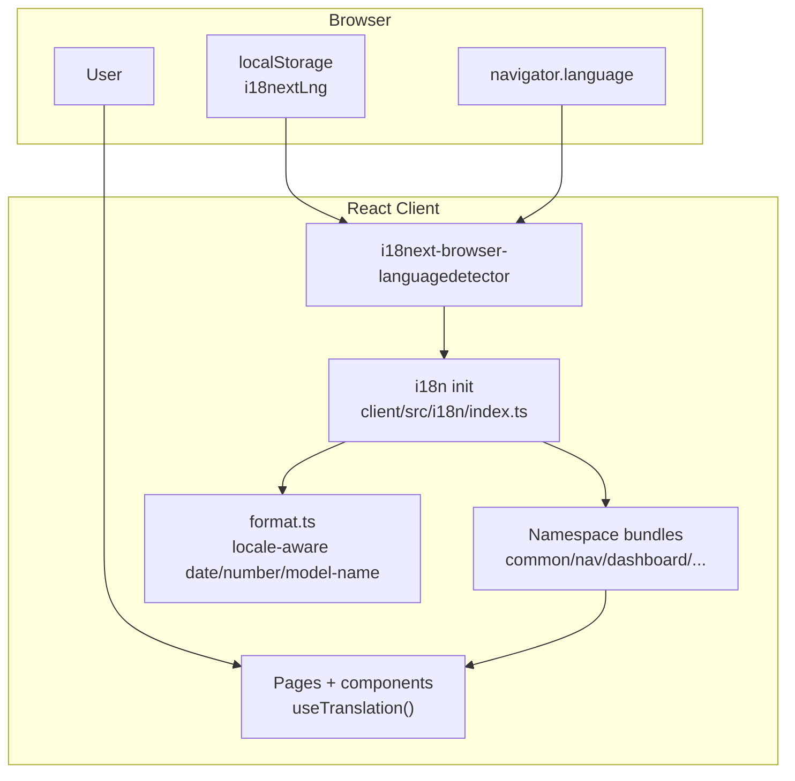
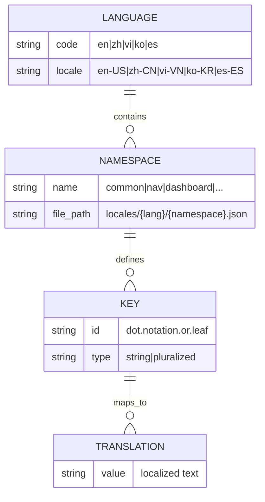
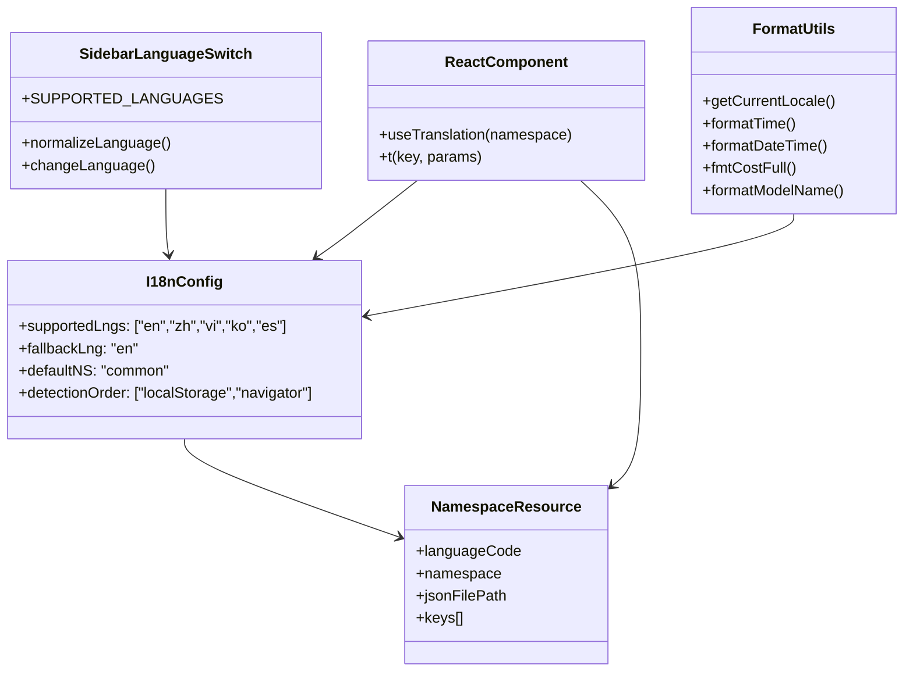
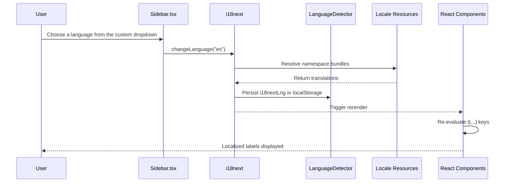
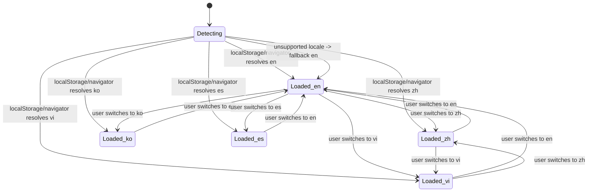
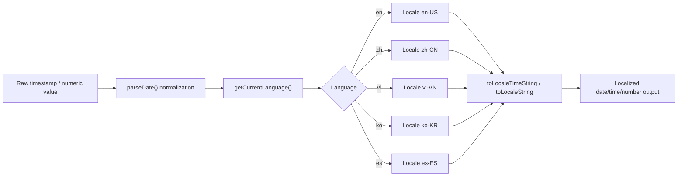
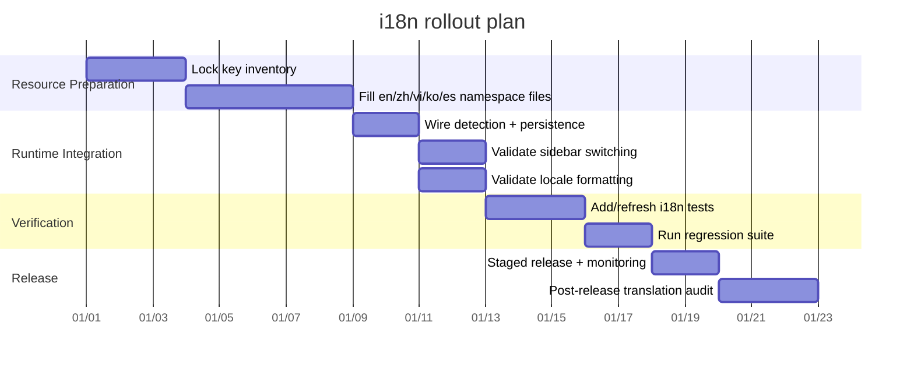

# Internationalization (i18n) Architecture and Usage

This guide documents how localization works in the Agent Dashboard, including architecture, resources, runtime behavior, testing, and rollout.

**Supported languages:** English (`en`), Chinese (`zh`), Vietnamese (`vi`), Korean (`ko`), Spanish (`es`)

> **Contributing a translation or a new language?** Jump to [Section 9 — Contributing translations](#9-contributing-translations-and-adding-a-language). The complete, file-by-file checklist lives in [`.claude/skills/i18n-parity/references/new-language-checklist.md`](../.claude/skills/i18n-parity/references/new-language-checklist.md), and `bash .claude/skills/i18n-parity/scripts/i18n-audit.sh` tells you exactly what is still missing.

---

## 1) Architecture Overview

Localization is implemented in the frontend with `i18next` + `react-i18next` and browser language detection.



**Key runtime facts**
- `supportedLngs`: `["en", "zh", "vi", "ko", "es"]`
- `fallbackLng`: `"en"`
- `nonExplicitSupportedLngs`: `true` (e.g. `es-ES` resolves to `es`)
- Detection order: `localStorage` → `navigator`

---

## 2) Resource and Namespace Strategy

Translation resources are stored per language and namespace:

- `client/src/i18n/locales/en/*.json`
- `client/src/i18n/locales/zh/*.json`
- `client/src/i18n/locales/vi/*.json`
- `client/src/i18n/locales/ko/*.json`
- `client/src/i18n/locales/es/*.json`

Active namespaces (the full list registered in `client/src/i18n/index.ts`):
- `common`
- `nav`
- `dashboard`
- `sessions`
- `activity`
- `analytics`
- `workflows`
- `settings`
- `kanban`
- `errors`
- `updates`
- `ccConfig`
- `run`
- `alerts`
- `splash`



**Strategy notes**
- Keep namespace boundaries page/domain focused.
- Keep key parity across `en`, `zh`, `vi`, `ko`, and `es` files for the same namespace.
- Keep fallback behavior deterministic by ensuring `en` is always complete.

### Translation quality checklist

When adding user-visible copy:

1. Write the English source string first, with enough nearby context for translators to understand where it appears.
2. Add the same key to every supported locale in the same change; a fallback is a safety net, not a completed translation.
3. Preserve interpolation tokens, Markdown fragments, code identifiers, command names, and environment-variable names exactly as written in English.
4. Reuse established product terminology within each locale instead of translating the same concept differently on each page.
5. Keep labels concise and test a narrow viewport after translation, especially for headings, buttons, and table actions.

---

## 3) Key Naming Conventions

Use stable semantic keys, not English sentence literals.

### Convention rules
1. Use namespace-scoped keys: `namespace:key`
2. Use lower camelCase key segments
3. Keep terminology consistent across locales (for example, keep `Agent` / `Subagent` terms stable where required)
4. Use the i18next v4 plural suffixes `_one` / `_other` (the client runs i18next 26; the legacy `_plural` suffix is no longer resolved). Every locale must carry both forms, even languages without plural inflection — give both the same string there.
5. Group nested concepts by domain (e.g. `time.justNow`, `time.mAgo`)

### Examples
- `nav:dashboard`
- `nav:languageNames.vi`
- `common:time.justNow`
- `common:time.mAgo`
- `common:subagent_label_one`
- `common:subagent_label_other`



---

## 4) Language Detection and Switching Flow

The sidebar language control is the shared custom `Select` dropdown used by the Run Claude page. It calls `i18n.changeLanguage()` and the UI updates reactively through `useTranslation`.





---

## 5) Date and Number Localization Behavior

Formatting utilities are centralized in `client/src/lib/format.ts`.

- `en` → `en-US`
- `zh` → `zh-CN`
- `vi` → `vi-VN`
- `ko` → `ko-KR`
- `es` → `es-ES`

`formatTime`, `formatDateTime`, and `fmtCostFull` use locale-aware `toLocale*` APIs.  
Timestamp parsing normalizes timezone-less SQLite datetime strings to UTC before display formatting.

`formatModelName` converts raw model identifiers (e.g. `claude-opus-4-7-20260101`, `claude-opus-4-7[1m]`) into human-friendly display names (e.g. "Claude Opus 4.7", "Claude Opus 4.7 (1M)"). This is locale-independent (brand names are proper nouns) and is applied across all UI surfaces except the Settings page (which shows raw patterns for pricing rule configuration).



---

## 6) Testing Strategy

Use client tests to verify translation correctness, fallback behavior, and locale formatting:

- `client/src/i18n/__tests__/i18n.test.ts`
- `client/src/lib/__tests__/format.test.ts`
- `client/tests/wiki-i18n.test.ts`
- `.claude/skills/i18n-parity/SKILL.md` — the localization workflow
- `.claude/skills/i18n-parity/references/new-language-checklist.md` — adding a language
- `.claude/skills/i18n-parity/references/translation-style.md` — glossary and style
- `.claude/skills/i18n-parity/scripts/i18n-audit.sh` — cross-surface parity gate
- `.claude/rules/i18n-parity.md`
- `.claude/rules/wiki-i18n.md`
- `client/src/components/__tests__/Sidebar.test.tsx`

Run:

```bash
npm run test:client
```

### Recommended test matrix

| Area | What to verify | Example |
|---|---|---|
| Resource parity | Same key coverage across `en/zh/vi/ko/es` | Missing key detection in CI |
| Locale fallback | Unknown locales fall back to `en` | `es-ES` resolves to `es` |
| Terminology consistency | Canonical terms stay stable | `Agent`/`Subagent` expectations |
| Date/number formatting | Locale-specific output shape | `zh-CN`, `vi-VN`, `ko-KR`, `es-ES` formatting |
| Runtime switching | UI rerenders without reload | Sidebar custom language dropdown |

---

## 7) Troubleshooting

| Symptom | Likely cause | Resolution |
|---|---|---|
| UI stays in old language after switch | Cached key or stale component state | Confirm `i18n.changeLanguage(...)` is called and component uses `useTranslation` |
| Unexpected fallback to English | Unsupported locale code | Ensure code normalizes to `en|zh|vi|ko|es` and key exists in target namespace |
| Missing text on one page | Namespace file key missing | Add key to all language files for that namespace |
| Date/time looks wrong | Locale mapping or timezone parse issue | Verify `getCurrentLocale()` and `parseDate()` behavior |
| Inconsistent term translation | Manual translation drift | Enforce glossary and update locale tests |

---

## 8) Rollout Checklist



### Operational checklist
- [ ] Confirm all namespaces exist for `en`, `zh`, `vi`, `ko`, `es`
- [ ] Confirm key parity across all locale JSON files
- [ ] Confirm language switching works in collapsed and expanded sidebar modes
- [ ] Confirm fallback behavior for region tags (e.g., `es-ES`, `vi-VN`, `zh-CN`)
- [ ] Confirm date/time/currency formatting for all supported languages
- [ ] Confirm client tests pass before release
- [ ] Confirm docs references are updated (`README`, `ARCHITECTURE`, `docs/README`)

---

## 9) Contributing Translations and Adding a Language

Localization spans **five independent surfaces**. English is the source of truth
on all of them, and a change is not done until every supported language carries
it **in the same PR** — a fallback to English is a safety net, never a completed
translation.

| # | Surface | English source | Translations live in |
|---|---|---|---|
| 1 | Dashboard UI | `client/src/i18n/locales/en/*.json` | `client/src/i18n/locales/<xx>/*.json` |
| 2 | Wiki page | English text in the `wiki/index.html` DOM | `wiki/script.js` (`T`, `ATTRIBUTE_TRANSLATIONS`, `META`) + `wiki/i18n-content.js` |
| 3 | Mirrored READMEs | `README.md` | `README-CN.md`, `README-VN.md`, `README-KO.md`, `README-ES.md` |
| 4 | Language switchers | — | `Sidebar.tsx`, `paletteCommands.ts`, `nav.json` (`languageNames` / `languageShort`), the two `.lang-select-menu` blocks in `wiki/index.html` |
| 5 | Locale-aware formatting | — | `client/src/lib/format.ts` |

### What is not localized

The root landing page `index.html` is **English-only by design** and has no i18n
layer (its `Languages (en/zh/…)` stat label merely enumerates the codes).
`client/index.html` is an English shell — `<html lang="en">`, `og:locale=en_US`,
English `<title>`/meta — and the React app does not reassign
`document.documentElement.lang` when the user switches language.

The CLI (`bin/ccam.js`), the MCP server (`mcp/`), the Express server
(`server/`), the desktop shell (`desktop/`), the VS Code extension, and the
statusline contain no i18n wiring; their output is English.
`client/src/lib/event-summary.ts` and `event-grouping.ts` build tool-event
headlines from English literals and sit outside the key system by design.

Number and date formatting is locale-aware only where the `format.ts` helpers
are used; most components call `toLocaleString()` directly, which follows the
browser locale rather than the selected UI language. Prefer `getCurrentLocale()`
in new code.

### Changing existing content

| You changed | You must also do |
|---|---|
| A UI string or i18n key | Add the key to `en` **and every other locale**, with the same key path, value type, and `{{interpolation}}` tokens |
| User-visible text in `wiki/index.html` | Add `zh` + `vi` + `ko` + `es` entries (see the wiki mechanism below), then bump `CACHE_NAME` in `wiki/sw.js` and the matching `?v=` query strings in `wiki/index.html` |
| A section of `README.md` | Mirror the same edit into `README-CN.md`, `README-VN.md`, `README-KO.md`, and `README-ES.md` — all four, every time |

### Adding a new language

Three things must be complete before a language PR is merged:

1. **A complete `README-<XX>.md` mirror** of `README.md` — every section, table
   row, code block, and mermaid diagram, in the same order. Not a summary.
2. **Every app key translated** — all 15 namespaces for the new locale, plus a
   `languageNames` / `languageShort` entry for it in *every* locale's `nav.json`
   so the switcher is labelled everywhere.
3. **A complete wiki translation** — a full body bundle and `plain` bundle in
   `wiki/i18n-content.js`, plus `T`, `META`, and every `ATTRIBUTE_TRANSLATIONS`
   entry in `wiki/script.js`. Translated headings over English paragraphs are
   worse than plain English.

Work through
[`new-language-checklist.md`](../.claude/skills/i18n-parity/references/new-language-checklist.md)
top to bottom; it lists every file in dependency order. Terminology, the shared
glossary, and the never-translate list are in
[`translation-style.md`](../.claude/skills/i18n-parity/references/translation-style.md).

### How the wiki translation mechanism works

The wiki is a static page: English lives in the DOM and `wiki/script.js` swaps
text at runtime.

- **Scannable layer** — the `PLAIN` selector set (`.logo-sub`, `.section-label`,
  `.nav-section`, `.nav-empty`, `.stat-label`, `.t-label`,
  `.main-content h2/h3/h4/th`, `.hero-desc`) plus the `TEXTNODE_SEL` trailing
  text nodes (`.nav-link`, `.hero-badge`) → keyed by plain English text in the
  `T` dictionary in `wiki/script.js`.
- **Body content** — the `HTML_SEL` set (`p`, `li`, `td`, `th`,
  `.screenshot-caption`, `.callout-body > strong`, `.route-desc`, footer) →
  keyed by the element's **whitespace-normalized `innerHTML`** in
  `wiki/i18n-content.js`. Values must keep the identical set of inline tags
  (`<code>`, `<strong>`, `<a>`, `<span>`).
- **Attributes** (`alt`, `aria-label`, `title`, `placeholder`) →
  `ATTRIBUTE_TRANSLATIONS` in `wiki/script.js`.
- **Page metadata** (title, description, OG/Twitter tags) → `META` in
  `wiki/script.js`.
- **Switcher label and detection** → `languageLabels`, the
  `document.documentElement.lang` ladder inside `apply()`, and the first-visit
  `navigator.language` ladder — all three in `wiki/script.js`.
- A new content container/class also needs its selector added to `HTML_SEL`
  (body prose) or `PLAIN` (scannable labels), or it is never translated.

The active language is stored in `localStorage["wiki-lang"]`; there is no
`?lang=` URL parameter. To preview a locale, use the switcher or run
`localStorage.setItem("wiki-lang", "<xx>")` in the console and reload.

`client/tests/wiki-i18n.test.ts` extracts `T`, `ATTRIBUTE_TRANSLATIONS`, and
`META` by slicing `wiki/script.js` on literal source markers, so add locales
*inside* those objects — renaming or reordering the declarations breaks the test.

Full details, including the block-length budgets the page's fixed-size cards
impose, are in
[`.claude/rules/wiki-i18n.md`](../.claude/rules/wiki-i18n.md).

### Never translate

Code and commands, file/directory paths, URLs, env-var names, CLI flags, HTTP
methods and status codes, code identifiers, numbers with units, brand and
product names, Claude Code hook event names (`PreToolUse`, `Stop`, …), and
Claude Code tool names (`Bash`, `Agent`, `Read`, `Edit`). Translate only the
prose around them. In mermaid diagrams, translate labels — never node IDs.

The Claude Code **tool** named `Agent` and the **UI noun** for an agent are
different things. The tool name is an identifier and stays literal in every
locale. The UI noun (`common:agent` / `common:subagent`) is literal in `zh`,
`vi`, and `ko` but deliberately `agente` / `subagente` in `es`, as asserted in
`client/src/i18n/__tests__/i18n.test.ts`. The Spanish exception never applies to
the tool name.

### Verify before opening the PR

```bash
bash .claude/skills/i18n-parity/scripts/i18n-audit.sh   # cross-surface parity; must exit 0
npm run test:client                                     # key/type/interpolation parity + formatting
cd client && npx vitest run tests/wiki-i18n.test.ts     # wiki live-DOM coverage
npm run format
```

The audit reads `supportedLngs` from `client/src/i18n/index.ts`, so once you
declare a locale there it names every surface still missing it.

---

## References

- `client/src/i18n/index.ts`
- `client/src/components/Sidebar.tsx`
- `client/src/lib/format.ts`
- `client/src/i18n/__tests__/i18n.test.ts`
- `client/src/lib/__tests__/format.test.ts`
